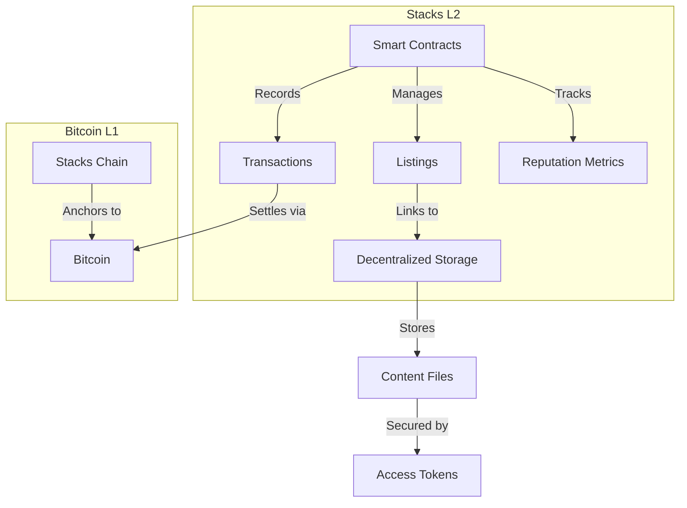

# BitContent: Decentralized Digital Content Marketplace

**BitContent** is a decentralized marketplace for secure peer-to-peer trading of digital content on the **Stacks blockchain**, with **Bitcoin** settlement assurance. By combining Stacks' scalability and smart contracts with Bitcoin's finality and security, BitContent creates a trustless, censorship-resistant digital content economy.

---

## 🚀 Key Features

### Content Management
- **Immutable Listings**: Register digital assets with permanent on-chain metadata
- **Dynamic Pricing**: Real-time price adjustments with `modify-price` function
- **Secure Token Delivery**: Encrypted access tokens released post-purchase

### Transaction Engine
- **Hybrid Settlement**: STX payments with BTC transaction finality
- **Auto-Fee Distribution**: 3% default fee split between creator/platform
- **Non-Custodial Escrow**: Funds held in smart contract until delivery

### Trust Infrastructure
- **Reputation Oracle**: Track seller performance metrics
- **Anti-Fraud Guard**: Prevent self-trades and invalid listings
- **Content Provenance**: Full ownership history tracing

---

## 🏗 System Architecture



### Core Components
1. **Listing Manager**  
   Handles content registration, pricing, and availability status
2. **Payment Gateway**  
   Processes STX transactions with BTC final settlement
3. **Reputation System**  
   Calculates trader scores based on historical activity
4. **Storage Adapter**  
   Manages encrypted content links and access control

---

## 📜 Smart Contract Functions

### Content Operations
```clarity
;; Register new content listing
(register-content 
  price 
  metadata 
  access-token 
  (content-type "video/mp4")
)

;; Purchase content
(acquire-content item-id)
```

### Management Functions
```clarity
;; Update listing price (seller only)
(modify-price item-id new-price)

;; Remove listing from marketplace
(delist-content item-id)
```

### Admin Controls
```clarity
;; Adjust platform fee (admin only)
(adjust-fee-rate new-percentage)
```

---

## 🔐 Security Architecture

### Multi-Layer Protection
1. **Input Validation**
   ```clarity
   (asserts! (< (len access-token) 256) ERR_INVALID_TOKEN)
   ```
2. **Ownership Checks**
   ```clarity
   (asserts! (is-eq owner tx-sender) ERR_UNAUTHORIZED_ACCESS)
   ```
3. **Financial Safeguards**
   ```clarity
   (define-private (calculate-fee (amount uint))
     (/ (* amount fee-rate) u100)
   )
   ```
4. **Anti-Exploit Measures**
   - Prevention of reentrancy attacks
   - Blocked self-trading
   - Storage size limits


---

## 🌍 Compliance Features

### Regulatory Adherence
- **Transaction Tracing**: Full audit trail compatible with Bitcoin's UTXO model
- **Tax Reporting**: Automated CSV export of trading activity
- **KYC Integration**: Optional identity verification module

### Fraud Prevention
- Seller reputation scoring system
- Content authenticity verification
- Transaction pattern analysis

---

## 🤝 Contribution Guidelines

1. Fork repository & create feature branch
2. Include comprehensive test coverage
3. Submit PR with architecture diagrams
4. Security review required for core changes
